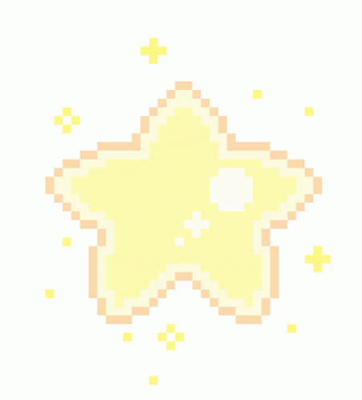

## Hi, I am Sophie Boak!

I am a recent graduate with a Bachelor of Arts (Japanese) and a Bachelor of Engineering (Robotics & Mechatronics). I am interested in software-focused robotics, and AI projects, especially those aimed at helping people. 

## About Me 
- 🌏 Passionate about languages and exploring different cultures, especially Japanese
- 🌿 Enjoy reading, exploring the outdoors and running  
- 🍬 Big sweet tooth — desserts are my guilty pleasure!

## Skills 
- Programming: Javascript, Python
- Software: MATLAB
- AI/ML: PyTorch, NumPy, OpenCV, Scikit_learn
- Other: Arduino, Raspberry Pi
## Projects 
- **AI Japanese Feedback Diary**: Just take a photo of your Japanese writing, let the program extract the text, and get helpful tips on grammar and vocabulary to improve your skills.
- **Final Year Project: Grasping Transparent and Deformable Plastic Bags**: Using a kuka iiwa robot, my team integrated computer vision and machine learning to detect tricky objects like transparent or deformable plastic bags, helping the robot handle everyday tasks more reliably.
- **Intelligent Robotics Project: PenguiPi**: Built an autonomous robot that explores unknown environments and finds target objects. It uses real-time object detection and mapping to navigate and avoid obstacles efficiently.
- **WildLife Robot Observer**: Built a small robot that is teleoperated from a laptop, navigating the arena using only the robot’s camera feed. The robot automatically detects 3D-printed animals while driving through a challenging arena, including inclines and cave-like obstacles. It uses computer vision and sensors to identify targets in real-time.
## Connect With Me 

  
  
    

